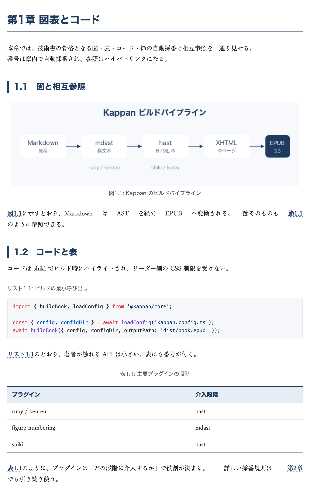

# Kappan（活版）

[](https://github.com/isozu/kappan/actions/workflows/ci.yml)
[](./LICENSE)
[](./.nvmrc)

<!-- npm 公開後に [](https://www.npmjs.com/package/@kappan/cli) を追加 -->

Markdown を入力とし、日本語組版・アクセシビリティ・モダンタイポグラフィを満たす商業品質の EPUB 3.3 を生成するツール。  
縦書き小説から横組み技術書まで、普段使いの Markdown がそのまま入稿品質のデジタル書籍になります。

> **A Markdown → EPUB 3.3 converter, built for Japanese typography.**  
> Ruby annotations, kenten (emphasis dots), tate-chuu-yoko (horizontal-in-vertical), and vertical writing (vertical-rl) — all as first-class citizens.

> **ステータス**：ベータ版（v0.3.0）。Markdown→EPUB 本体・日本語縦書き組版・Re:VIEW 移行まで動作し、EPUBCheck / ACE を通過。`@kappan/*` 全 20 パッケージは npm 公開準備済み（lockstep）。公開 API は凍結済み（破壊的変更は事前告知）。

---

## ショーケース

### 全部入り（Saiun テーマ）

ルビ（パイプ＋属性）・圏点・図表番号・コードハイライト・相互参照・数式・脚注・索引・囲み記事・コラム——主要記法を 1 冊に詰め込んだ完成見本。下はその第1章（図・番号付きコード・表・相互参照リンク）。



→ [`examples/showcase-all-features/`](./examples/showcase-all-features/)（囲み記事・コラムの誌面は [`screenshots/ch03.png`](./examples/showcase-all-features/screenshots/ch03.png) を参照）

### 縦書き小説（Sumi テーマ）

ルビ・圏点・縦中横・章扉・会話文制御を備えた本格的な縦組み小説。


→ [`examples/showcase-novel/`](./examples/showcase-novel/)（オリジナル短編「灯台守の最後の夜」）

### 横組み技術書（Saiun テーマ）

shiki シンタックスハイライト・図表番号と章をまたぐ相互参照・巻末索引・KaTeX 数式・脚注を備えた技術書。


→ [`examples/showcase-techbook/`](./examples/showcase-techbook/)（技術書「Kappan で技術書を書く」）

各サンプルは `pnpm kappan build --config <dir>/kappan.config.ts --validate` で再現でき、EPUBCheck 0 errors を通過する。

---

## Re:VIEW という先達

[Re:VIEW](https://github.com/kmuto/review) は、日本語技術書出版の事実上の標準として長く使われてきたツールです。ルビ・圏点・縦中横といった日本語組版要素を構造的に扱う設計思想は、Kappan が大いに参考にしました。囲み記事（`//note` 等）やコラム（`//column`）も、Markdown ネイティブの `:::note` / `:::column` として一級記法で書けます。

`kappan migrate` は、Re:VIEW で蓄積した原稿資産を Markdown ワークフローへ持ち込むための移行パスです（`//note` → `:::note`、`//column` → `:::column` に変換）。

→ [`examples/showcase-migration/`](./examples/showcase-migration/) / [`docs/migrating-from-review.md`](./docs/migrating-from-review.md)

---

## 特徴

- **Markdown ネイティブ** — Obsidian・GitHub・VS Code・Notion、普段使いのエディタの資産がそのまま乗る
- **縦書き小説に対応** — `writing-mode: vertical-rl`、ルビ・圏点・縦中横・約物連続・章扉・会話文制御まで。Kindle Unlimited の縦書き小説を商業品質で組める
- **EPUB 3.3 ファーストクラス** — リフロー・脚注ポップアップ・メタデータが一級市民。紙 PDF 優先の設計ではない
- **アクセシビリティを強制** — EPUBCheck 0 errors + ACE by DAISY をビルドゲートに。EAA / 改正障害者差別解消法への対応を最初から組み込む
- **囲み記事・コラム** — `:::note` / `:::warning` の注記から、目次掲載＋相互参照つきの `:::column` まで、Markdown ネイティブ（`remark-directive`）で書ける
- **AST プラグインエコシステム** — 13 公式プラグイン + 5 テーマ。`definePlugin` で拡張し、zod で型安全
- **モダンな DX** — `kappan preview` のライブリロード（HMR 中央値 7ms）、公式 Docker イメージ、CI 回帰検出

---

## 対応記法ハイライト

CommonMark + GFM に加え、日本語書籍に必要な記法を AST レベルで拡張している（コードブロック内は壊さない）。

```markdown
ルビはパイプ {活版|かっぱん} でも属性 [校正]{ruby="こうせい"} でも。圏点 [重要]{.kenten}、縦中横は自動。

図表番号と相互参照：{#fig:arch} → 本文で [@fig:arch]。
索引：{!活版印刷|かっぱんいんさつ!} は巻末索引に集約。
数式：$E = mc^2$（既定 MathML 出力）。

:::warning[互換性の注意]
古いリーダーでは MathML が表示できない。
:::

:::column[なぜ速いのか]{#col:why-fast}
コラム本文。目次に載り、本文から [@col:why-fast] で参照できる。
:::
```

これらが実際に組まれた誌面は [`examples/showcase-all-features/`](./examples/showcase-all-features/)（全部入り）で確認できる。記法の全一覧は [`docs/reference/notations.md`](./docs/reference/notations.md)。

---

## インストール

```bash
# npm から（公開後）
npm i -g @kappan/cli
kappan init my-novel --template novel     # 縦書き小説
kappan init my-book  --template tech-book # 横組み技術書

# または npx で都度実行
npx @kappan/cli build --config kappan.config.ts --validate
```

リポジトリから動かす場合は次節「5 分で動かす」を参照。

## 必要環境

- Node.js 20 LTS 以上（`.nvmrc` で 20.19.6 を指定）
- pnpm 10+（Corepack で `packageManager` を解決）
- Java 17+（EPUBCheck 実行用、任意）
- ACE by DAISY（任意、`pnpm add @daisy/ace-core @daisy/ace-axe-runner-puppeteer` で追加）

## 5 分で動かす

```bash
git clone https://github.com/isozu/kappan.git
cd kappan
corepack enable
pnpm install

# 新規プロジェクトをテンプレートから作る
pnpm kappan init my-book --template tech-book

# 同梱の最小フィクスチャをビルド
pnpm kappan build --config tests/fixtures/minimal-commonmark/kappan.config.ts

# EPUBCheck 込みで検証する場合
pnpm epubcheck:fetch
pnpm kappan build --config tests/fixtures/minimal-commonmark/kappan.config.ts --validate

# Saiun テーマ + 公式プラグイン全部入りのデモ（相互参照 + 索引 + KaTeX）
pnpm kappan build --config tests/fixtures/tech-book-yokogumi/kappan.config.ts --validate

# ライブプレビュー（中央値 HMR ≈ 7ms）
pnpm kappan preview --config tests/fixtures/tech-book-yokogumi/kappan.config.ts
```

詳細手順は [`docs/quickstart.md`](./docs/quickstart.md) を参照。

---

## スコープ

| 機能                                                                           | 状態     |
| ------------------------------------------------------------------------------ | -------- |
| CommonMark + GFM パイプライン                                                  | 対応済み |
| GFM 脚注（`epub:type="footnotes"` で XHTML 化）                                | 対応済み |
| 画像取り込み（alt 必須）                                                       | 対応済み |
| schema.org accessibility メタデータ自動付与                                    | 対応済み |
| EPUBCheck 5.x 統合                                                             | 対応済み |
| ルビ（`{漢字\|かんじ}` / 属性形式）・圏点（`[重要]{.kenten}`）                 | 対応済み |
| シンタックスハイライト（shiki）                                                | 対応済み |
| 禁則処理（JLReq 準拠の前段）                                                   | 対応済み |
| HTML 埋め込み 3 段階モデル（`false` / `'sanitized'` / `'trusted'`）            | 対応済み |
| プラグイン API ランタイム（`definePlugin` + zod 検証）                         | 対応済み |
| `defineTheme` API                                                              | 対応済み |
| Re:VIEW 移行ツール（catalog 4 セクション、3 種 fixture が EPUBCheck 0 errors） | 対応済み |
| `kappan preview`（SSE + chokidar、HMR 中央値 ≈ 7ms）                           | 対応済み |
| 公式 Docker イメージ（`ghcr.io/kappan/build:0.3`）                             | 対応済み |
| ベンチしきい値判定（Welch's t-test / IQR 1.5× / 累積 15%）                     | 対応済み |
| 図表番号・相互参照（fig/tbl/lst + sec/eq/chap、章をまたぐ参照）                | 対応済み |
| 囲み記事（`:::note` 〜 `:::memo`、remark-directive）                           | 対応済み |
| コラム（`:::column[題]{#col:id}`、目次掲載 + `[@col:id]` 相互参照）            | 対応済み |
| 索引（`{!語!}` / `[語]{.index reading=""}`、巻末索引自動生成）                 | 対応済み |
| KaTeX 数式（`$...$` / `$$...$$`、MathML 出力）                                 | 対応済み |
| テーマ 5 種（Mono / Saiun / Kohaku / Hibana / Sumi=縦書き小説）                | 対応済み |
| ACE 完全準拠（`--ace --strict`、コントラスト比 / landmark / epub:type 検証）   | 対応済み |
| リーダー互換性マトリクス CI（四半期 cron）                                     | 対応済み |
| Re:VIEW PART ネスト正規変換 / stylesheet → テーマ拡張 CSS 転記                 | 対応済み |
| CLI 5 コマンド（init / build / preview / check / themes / plugin / migrate）   | 対応済み |
| 縦組み（vertical-rl + page-progression rtl、ルビ/圏点/縦中横の縦位置）         | 対応済み |
| 約物連続化（`──`/`……`）・会話文/地の文の 1 字下げ制御                          | 対応済み |
| Sumi テーマ（縦書き小説、章扉・天付き 1 字下げ）+ reader 差異吸収              | 対応済み |
| 柱・ノンブル（リフローはリーダー任せ）／固定レイアウト                         | 予定     |
| LSP / メディアオーバーレイ                                                     | 予定     |

---

## リーダー互換性

EPUB リーダーの実装差異は本ツールの仕様だけでは吸収しきれない。最低互換ターゲットを示す。
表は `tests/reader-compatibility/matrix.json` をソースとし、`.github/workflows/reader-matrix.yml`
が四半期ごとに自動再生成する（`tests/reader-compatibility/scripts/update-readme.ts`）。

<!-- READER-MATRIX:START -->

_最終更新: 2026-05-27。この表は
`.github/workflows/reader-matrix.yml` が四半期ごとに自動再生成する。`✅` 完全対応 /
`⚠` 部分対応または表示差異 / `❌` 未対応。縦組み（vertical-rl）は
Chromium（Thorium 近似）で構造・レイアウトを自動検証している。実フォントでの最終目視はユーザー領域。_

### 横組み（horizontal-tb）

| 機能                                   | Apple Books | Kindle (KFX) | Kobo | honto | Thorium |
| -------------------------------------- | ----------- | ------------ | ---- | ----- | ------- |
| リフロー表示                           | ✅          | ✅           | ✅   | ✅    | ✅      |
| ルビ                                   | ✅          | ✅           | ⚠    | ✅    | ✅      |
| 圏点                                   | ✅          | ⚠            | ❌   | ✅    | ✅      |
| OpenType機能                           | ✅          | ⚠            | ⚠    | ⚠     | ✅      |
| 埋め込みフォント                       | ✅          | ✅           | ⚠    | ✅    | ✅      |
| MathML                                 | ✅          | ❌           | ❌   | ❌    | ✅      |
| 数式SVG                                | ✅          | ✅           | ✅   | ✅    | ✅      |
| 図表番号・相互参照                     | ✅          | ✅           | ✅   | ✅    | ✅      |
| 脚注ポップアップ（epub:type=footnote） | ✅          | ⚠            | ⚠    | ⚠     | ✅      |

### 縦組み（vertical-rl）

| 機能                                        | Apple Books | Kindle (KFX) | Kobo | honto | Thorium |
| ------------------------------------------- | ----------- | ------------ | ---- | ----- | ------- |
| 縦書き（vertical-rl・page-progression rtl） | ✅          | ✅           | ⚠    | ✅    | ⚠       |
| 縦組みルビ（ruby-position: right）          | ✅          | ⚠            | ⚠    | ✅    | ⚠       |
| 縦組み圏点（text-emphasis-position）        | ✅          | ⚠            | ❌   | ✅    | ⚠       |
| 縦中横（tcy・text-combine-upright）         | ✅          | ⚠            | ⚠    | ✅    | ✅      |
| 連続約物（ダーシ・三点リーダ非改行）        | ✅          | ✅           | ⚠    | ✅    | ✅      |
| 会話文・地の文の字下げ制御                  | ✅          | ✅           | ✅   | ✅    | ✅      |
| 章頭改ページ（break-before）                | ✅          | ✅           | ✅   | ✅    | ✅      |

<!-- READER-MATRIX:END -->

> **数式の Kindle 互換について**：KaTeX のデフォルト出力 MathML は Kindle 非対応（上表）。Kindle ターゲットでは `katexMath({ output: 'htmlAndMathml' })` で HTML+CSS の視覚表示を併記する（KaTeX は SVG 出力を持たない）。詳細は [`docs/howto/add-katex-math.md`](./docs/howto/add-katex-math.md)。

---

## パッケージ構成（全 23 パッケージ / 公開済）

| パッケージ                        | 責務                                                                                            |
| --------------------------------- | ----------------------------------------------------------------------------------------------- |
| `@kappan/core`                    | パイプライン、設定、プラグイン API ランタイム、a11y / ACE 検証、`defineTheme`、3 フェーズビルド |
| `@kappan/epub-packager`           | OPF / NAV / ZIP の組み立て                                                                      |
| `@kappan/cli`                     | `init / build / preview / check / themes / plugin / migrate` コマンド                           |
| `@kappan/themes-mono`             | 装飾を最小化したベースラインテーマ                                                              |
| `@kappan/themes-saiun`            | 技術書・実用書向け（明朝＋サンセリフ、青系アクセント）                                          |
| `@kappan/themes-kohaku`           | 学術書向け（琥珀アクセント、参考文献等幅）                                                      |
| `@kappan/themes-hibana`           | マニュアル向け（手順バッジ等）                                                                  |
| `@kappan/themes-sumi`             | 縦書き小説向け（縦組み実装済、章扉・天付き 1 字下げ・約物連続化）                               |
| `@kappan/remark-jp`               | 日本語拡張記法（ルビ・圏点・約物連続化 punctuation・会話文判定 dialogue）                       |
| `@kappan/remark-tech`             | 技術書向け拡張（shiki ハイライト・KaTeX 数式）                                                  |
| `@kappan/plugin-review-compat`    | Re:VIEW 記法の部分受理レイヤー                                                                  |
| `@kappan/plugin-figure-numbering` | 図表番号と相互参照（fig/tbl/lst/sec/eq/chap、章をまたぐ）                                       |
| `@kappan/plugin-admonition`       | 囲み記事（`:::note` 〜 `:::memo`、remark-directive）                                            |
| `@kappan/plugin-column`           | コラム（`:::column`、目次掲載 + `[@col:id]` 相互参照）                                          |
| `@kappan/plugin-toc`              | 読者向け目次ページ生成（章・節・コラムを掲載）                                                  |
| `@kappan/plugin-jp-index`         | 索引生成（MeCab 不使用、kuromoji.js 任意）                                                      |
| `@kappan/plugin-kinsoku`          | 禁則処理                                                                                        |
| `@kappan/plugin-wahukon`          | 和欧混植の文字間調整                                                                            |
| `@kappan/plugin-tcy-smart`        | 縦中横の文脈判定                                                                                |
| `@kappan/plugin-yojijukugo`       | 四字熟語の表記統一                                                                              |
| `@kappan/plugin-ruby-auto`        | 難読漢字ルビ自動付与（kuromoji.js）                                                             |
| `@kappan/plugin-reader-shim`      | リーダー差異吸収プロファイル                                                                    |
| `@kappan/migrate-review`          | `kappan migrate` の実体（CLI 経由で使用）                                                       |

---

## 開発

```bash
pnpm test               # 全テスト実行
pnpm test:update-golden # ゴールデンファイルを更新
pnpm typecheck          # 全パッケージの型チェック
pnpm bench              # ビルド時間ベンチマーク
pnpm bench:compare      # PR 用の Welch's t-test + IQR + 累積判定
```

---

## ドキュメント

- [`docs/quickstart.md`](./docs/quickstart.md)：書籍著者向けクイックスタート
- [`docs/tutorial-tech-book.md`](./docs/tutorial-tech-book.md)：横組み技術書チュートリアル（90 分）
- [`docs/tutorial-novel-tategumi.md`](./docs/tutorial-novel-tategumi.md)：縦組み小説チュートリアル
- [`docs/howto/`](./docs/howto/)：目的別 HOWTO（移行・ルビ・索引・数式・テーマ・Kindle 入稿・縦組み実機確認・プレビュー・プラグイン）
- [`docs/reference/config.md`](./docs/reference/config.md) / [`docs/reference/notations.md`](./docs/reference/notations.md)：設定・記法リファレンス
- [`docs/migrating-from-review.md`](./docs/migrating-from-review.md)：Re:VIEW プロジェクトの移行ガイド
- [`docs/plugin-authoring.md`](./docs/plugin-authoring.md)：プラグイン作者向けガイド

---

## コントリビュート

Issue・PR を歓迎します。開発環境のセットアップ、テスト、changeset の使い方は [`CONTRIBUTING.md`](./CONTRIBUTING.md) を参照してください。行動規範は [`CODE_OF_CONDUCT.md`](./CODE_OF_CONDUCT.md)、脆弱性報告は [`SECURITY.md`](./SECURITY.md) にあります。プラグインを書きたい場合は [`docs/plugin-authoring.md`](./docs/plugin-authoring.md) から始められます。

---

## ライセンス

[MIT](./LICENSE) © isozu
