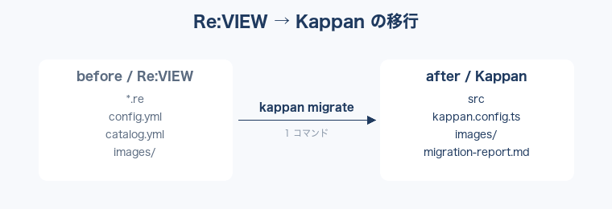

# 第2章 ブロック記法 {#block}

コードブロックは `//list` で書く。キャプションと言語を指定できる。

<a id="list-greet"></a>
**挨拶を返す関数**
```typescript
function greet(name: string): string {
  return `こんにちは、${name}さん`;
}
```

図は `//image` で挿入する。画像は images/ に置く。



注釈ブロックは `//note` で書ける。

> [!NOTE]
> Re:VIEW の //note は Kappan では GFM の注釈（> [!NOTE]）に変換される。

引用は `//quote` を使う。

> 道具を変えても、書いた内容は失われない。
