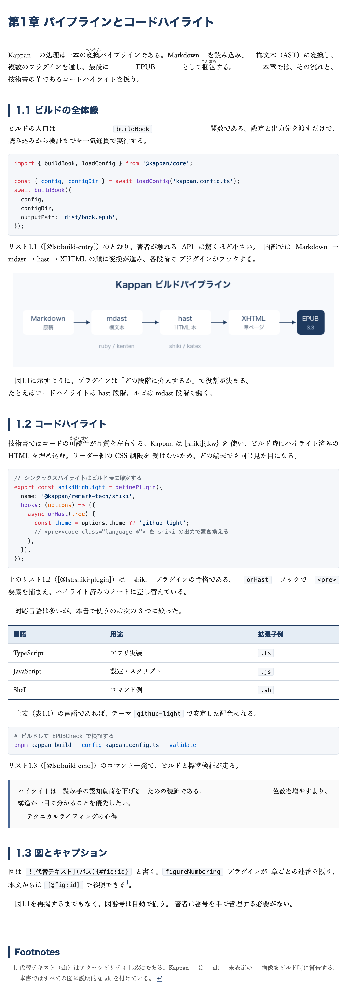

# showcase-techbook — 横組み技術書ショーケース

Kappan で組んだ横組み技術書の完成見本です。Markdown 原稿から 1 コマンドで
EPUB 3.3 を生成し、技術書に必要な組版要素が自然に揃うことを示します。

題材は「Kappan を使って技術書を書く」こと自体。通しで読めば使い方が分かり、
誌面を眺めれば Saiun（彩雲）テーマの見た目が分かる二重構造になっています。



## 見どころ

| 要素 | 記法 | 担当プラグイン / テーマ |
| --- | --- | --- |
| コードハイライト | ` ```typescript ` フェンス | `shikiHighlight`（ビルド時に確定、リーダー非依存） |
| 図表番号 + 相互参照 | `{#fig:id}` ／ 表・コードの隣にキャプション段落 `説明 {#tbl:id}` `説明 {#lst:id}` → `[@fig:id]`（リンク化） | `figureNumbering`（章・節・図・表・リスト・式、参照はアンカーへのハイパーリンク） |
| 巻末索引 | `{!用語!}` / `{!用語\|よみ!}` | `jpIndex`（五十音順に自動生成、genindex） |
| 数式 | `$$...$$` / `$...$` | `katexMath`（既定で MathML 出力、アクセシブル） |
| ルビ・圏点 | `{漢字\|かんじ}` / `[語]{.kenten}` | `ruby` / `kenten`（remark-jp） |
| 脚注 | `[^id]` | GFM 脚注（章末に集約） |

これらは個別の道具の寄せ集めではなく、ひとつの `kappan.config.ts` に宣言するだけで
一冊にまとまります。プラグインの実行順序には意味があり（索引アンカーの解決、
数式番号の採番）、`kappan.config.ts` のコメントに理由を記しています。

## 構成

```
showcase-techbook/
├─ kappan.config.ts       # テーマ(saiun) + プラグイン構成
├─ src/
│  ├─ index.md            # はじめに
│  ├─ ch01.md             # パイプラインとコードハイライト
│  ├─ ch02.md             # 相互参照と巻末索引
│  ├─ ch03.md             # 数式と脚注
│  └─ ch04.md             # Re:VIEW からの移行
├─ assets/images/         # 図版（SVG ソース + PNG）
├─ screenshots/           # 横組みレイアウトの描画結果
└─ capture-screenshots.ts # スクリーンショット生成スクリプト
```

## ビルド

```sh
# リポジトリのルートから実行
pnpm kappan build --config examples/showcase-techbook/kappan.config.ts --validate
```

`--validate` を付けると、ビルド後に EPUBCheck が走ります（Java 17+ と
`pnpm epubcheck:fetch` での EPUBCheck 取得が必要）。本ショーケースは
**EPUBCheck 0 errors / 0 warnings** を満たします。出力は `dist/kappan-techbook.epub`。

## スクリーンショット

```sh
node --import tsx examples/showcase-techbook/capture-screenshots.ts
```

ショーケースをその場でビルドして展開し、Chrome for Testing（puppeteer-core）で
各章を描画して `screenshots/` に PNG を保存します。`techbook.png` は README の
ヒーロー画像（第1章）です。

| ファイル | 内容 |
| --- | --- |
| `techbook.png` | ヒーロー画像（第1章：コードハイライト・図・図表番号） |
| `ch00.png`〜`ch04.png` | 各章の横組みレイアウト |
| `genindex.png` | 自動生成された巻末索引 |

Chrome for Testing は `~/.cache/puppeteer` から自動検出します。見つからない場合は
`PUPPETEER_EXECUTABLE_PATH` を指定するか、`npx @puppeteer/browsers install chrome@stable`
で取得してください。
