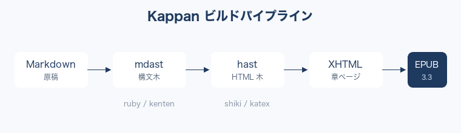

# 第1章 パイプラインとコードハイライト {#ch01}

Kappan の処理は一本の{変換|へんかん}パイプラインである。Markdown を読み込み、
構文木（AST）に変換し、複数のプラグインを通し、最後に EPUB として{梱包|こんぽう}する。
本章では、その流れと、技術書の華であるコードハイライトを扱う。

## 1.1 ビルドの全体像 {#sec:pipeline}

ビルドの入口は `buildBook` 関数である。設定と出力先を渡すだけで、
読み込みから検証までを一気通貫で実行する。

```typescript
import { buildBook, loadConfig } from '@kappan/core';

const { config, configDir } = await loadConfig('kappan.config.ts');
await buildBook({
  config,
  configDir,
  outputPath: 'dist/book.epub',
});
```

リスト1.1（[@lst:build-entry]）のとおり、著者が触れる API は驚くほど小さい。
内部では Markdown → mdast → hast → XHTML の順に変換が進み、各段階で
プラグインがフックする。

{#fig:pipeline}

[@fig:pipeline]に示すように、プラグインは「どの段階に介入するか」で役割が決まる。
たとえばコードハイライトは hast 段階、ルビは mdast 段階で働く。

## 1.2 コードハイライト {#sec:highlight}

技術書ではコードの{可読性|かどくせい}が品質を左右する。Kappan は [shiki]{.kw} を
使い、ビルド時にハイライト済みの HTML を埋め込む。リーダー側の CSS 制限を
受けないため、どの端末でも同じ見た目になる。

```typescript
// シンタックスハイライトはビルド時に確定する
export const shikiHighlight = definePlugin({
  name: '@kappan/remark-tech/shiki',
  hooks: (options) => ({
    async onHast(tree) {
      const theme = options.theme ?? 'github-light';
      // <pre><code class="language-*"> を shiki の出力で置き換える
    },
  }),
});
```

上のリスト1.2（[@lst:shiki-plugin]）は shiki プラグインの骨格である。
`onHast` フックで `<pre>` 要素を捕まえ、ハイライト済みのノードに差し替えている。

対応言語は多いが、本書で使うのは次の 3 つに絞った。

| 言語       | 用途           | 拡張子例 |
| ---------- | -------------- | -------- |
| TypeScript | アプリ実装     | `.ts`    |
| JavaScript | 設定・スクリプト | `.js`    |
| Shell      | コマンド例     | `.sh`    |

上表（表1.1）の言語であれば、テーマ `github-light` で安定した配色になる。

```shell
# ビルドして EPUBCheck で検証する
pnpm kappan build --config kappan.config.ts --validate
```

リスト1.3（[@lst:build-cmd]）のコマンド一発で、ビルドと標準検証が走る。

> ハイライトは「読み手の認知負荷を下げる」ための装飾である。
> 色数を増やすより、構造が一目で分かることを優先したい。
>
> — テクニカルライティングの心得

## 1.3 図とキャプション

図は `{#fig:id}` と書く。`figureNumbering` プラグインが
章ごとの連番を振り、本文からは `[@fig:id]` で参照できる[^ch1-alt]。

[@fig:pipeline]を再掲するまでもなく、図番号は自動で揃う。
著者は番号を手で管理する必要がない。

[^ch1-alt]: 代替テキスト（alt）はアクセシビリティ上必須である。Kappan は alt 未設定の
    画像をビルド時に警告する。本書ではすべての図に説明的な alt を付けている。
