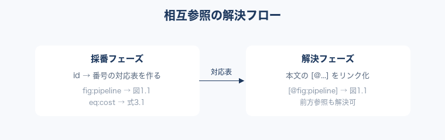

# 第2章 相互参照と巻末索引 {#ch02}

長い技術書では「あの図はどこだったか」「あの用語の定義は」という{往復|おうふく}が
読者の負担になる。本章では、章をまたいだ相互参照と、巻末索引の作り方を扱う。

本章は [@chap:ch01] で見たパイプラインを前提に、参照解決がどの段階で
起きるかを掘り下げる。

## 2.1 章・節・図表の相互参照 {#sec:xref}

Kappan は 6 種類の参照に対応する。いずれも `[@種別:id]` の形で書く。

| 種別   | 記法例          | 表示例     |
| ------ | --------------- | ---------- |
| 章     | `[@chap:ch01]`  | 第1章へのリンク |
| 節     | `[@sec:xref]`   | 節へのリンク |
| 図     | `[@fig:id]`     | 図2.1      |
| 表     | `[@tbl:id]`     | 表2.1      |
| リスト | `[@lst:id]`     | リスト2.1  |
| 数式   | `[@eq:id]`      | 式2.1      |

表2.1（[@tbl:xref-kinds]）の参照はすべてハイパーリンクになり、リーダー上で
ジャンプできる。番号は `figureNumbering` が採番するため、章の入れ替えにも追従する。

{#fig:xref}

[@fig:xref]のように、参照は「採番フェーズ」で id → 番号の対応表を作り、
「解決フェーズ」で本文中の `[@...]` をリンクに置き換える。この 2 段構えにより、
前方参照（まだ出てきていない図への参照）も正しく解決できる。

## 2.2 巻末索引 {#sec:index}

{!索引|さくいん!}は、用語を `{!用語!}` あるいは `{!用語|よみ!}` で囲むだけで作れる。
`jpIndex` プラグインが出現箇所を集め、{五十音|ごじゅうおん}順に並べた巻末索引を
自動生成する。

たとえば本書では {!AST|えーえすてぃー!} や {!プラグイン|ぷらぐいん!} を索引語として
登録している。同じ語が複数の章に出てきても、索引側でまとめてくれる。

```typescript
// 索引語はビルド時に収集され、genindex.xhtml にまとまる
interface IndexEntry {
  term: string; // 表示する語
  reading: string; // 並べ替えに使う読み（五十音順）
  refs: string[]; // 出現箇所（章 id）
}
```

リスト2.1（[@lst:index-entry]）は索引エントリの内部表現である。読み（`reading`）を
持たせることで、{漢字|かんじ}の用語でも正しい五十音順に並ぶ。

> 索引の質は技術書の「引ける度」を決める。書きながら `{!...!}` を振っておけば、
> 入稿直前にまとめて索引を作る苦労から解放される。
>
> — 索引づくりの実感

巻末の索引ページ（genindex）は目次からも辿れる。読者は {!プラグイン!} のような
語から、それが登場する章へ一足飛びに移動できる[^ch2-index]。

[^ch2-index]: 索引アンカーのリンク先は、見出しに付けた `{#chXX}` を利用する。
    そのため `jpIndex` は `figureNumbering` より前に実行する必要がある——
    後者が見出しの id を加工する前に、リンク先を確定させておくためである。
